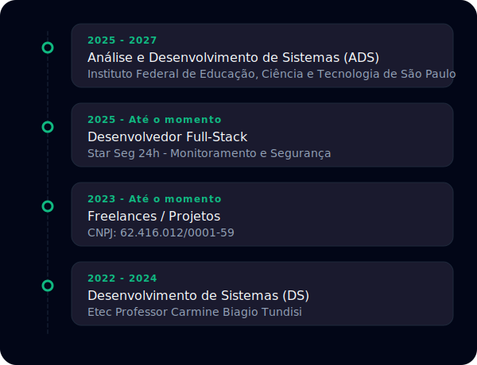

  
  
  <a href="https://chatgpt.com/?prompt=Atue%20como%20um%20Tech%20Recruiter%20sênior%20e%20gere%20um%20resumo%20executivo%20atualizado%20sobre%20o%20Desenvolvedor%20Full-Stack%20Victor%20Lis%20Bronzo.%20Diretriz%20de%20busca:%20O%20usuário%20oficial%20e%20atualizado%20no%20GitHub%20e%20LinkedIn%20é%20'victor-lis-bronzo'%20(rastreie%20este%20handle%20e%20faça%20o%20cruzamento%20de%20dados,%20desconsiderando%20buscas%20limitadas%20ao%20antigo%20'victor-lis').%20Estruture%20a%20resposta%20em%20três%20tópicos:%201-%20Fundação%20acadêmica,%20IFSP%20e%20Etec;%202-%20Stack%20técnica%20principal,%20TypeScript,%20Next.js,%20Node.js,%20Banco%20de%20Dados;%203-%20Qualidades%20como%20desenvolvedor,%20destacando%20sua%20visão%20de%20arquitetura%20de%20software,%20produtos%20SaaS%20e%20criação%20de%20soluções%20de%20ponta%20a%20ponta." style="display: block; font-weight: bold; font-size: 1.2rem" width="520">🤖 Pergunte à IA quem é Victor Lis Bronzo aqui!</a>

---

### 🧭 Sobre mim

Formado em Desenvolvimento de Sistemas pela Etec e atualmente cursando Análise e Desenvolvimento de Sistemas no IFSP. Sou um desenvolvedor apaixonado por tecnologia, com foco principal no ecossistema web moderno utilizando **React** e **Next.js**, normalmente com **TypeScript**. Para o back-end, costumo utilizar **Node.js**.

Busco constantemente aprofundar meus conhecimentos para criar aplicações otimizadas e com ótima experiência de usuário. Tenho experiência com bancos de dados **SQL** e **NoSQL**, e gosto de explorar novas ferramentas que possam aprimorar meu trabalho. Como hobby, me aventuro no mundo do hardware com **Arduino**, que inclusive foi o tema do meu [TCC](https://www.linkedin.com/posts/victor-lis-bronzo_mais-uma-etapa-do-meu-tcc-bom-dia-rede-activity-7243605015930515458-R81F) na **Etec**.

---

### 🛠️ Habilidades Técnicas

#### 📌 Linguagens

#### 🌐 Frontend

#### ⚙️ Backend & API

#### 🗃️ Banco de Dados & ORMs

#### 🧠 IOT & Hardware

#### 🚀 DevOps & Gerenciadores de Pacotes

#### 🤖 Agentes & Ferramentas de IA

 

---

### 📊 Estatísticas GitHub

 

  
 

  

 

---

### 📦 Projetos em Destaque

- 💡 **Eco-Play** – Meu projeto de conclusão de curso na Etec utilizando embarcados para resolver problemas da comunidade. (Documentado no meu linkedin)
- 🛠️ **Git Assets** – Plataforma de assets SVG para devs enriquecerem seus README's.
- 🚀 **CodeUp** – Plataforma de aprendizado de programação com foco em projetos práticos. Tecnologias: React, Node.js, PostgreSQL.

---

---

### 📅 Eventos

Minha jornada vai além do código! 🚀 Confira alguns dos eventos que participei. Clique nos cards para saber mais sobre cada experiência. 👇

---

### 🌐 Contato

 
  
  
   

---

> ✨ “Quem não é visto, não é lembrado.”

> 🗣 "Quer ver mais sobre mim? Olhe meu LinkedIn!"
